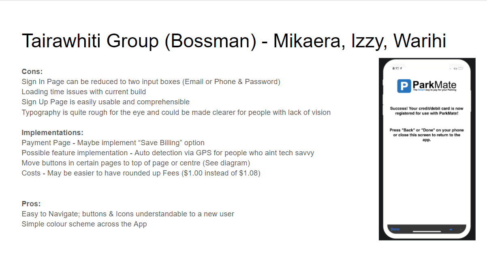
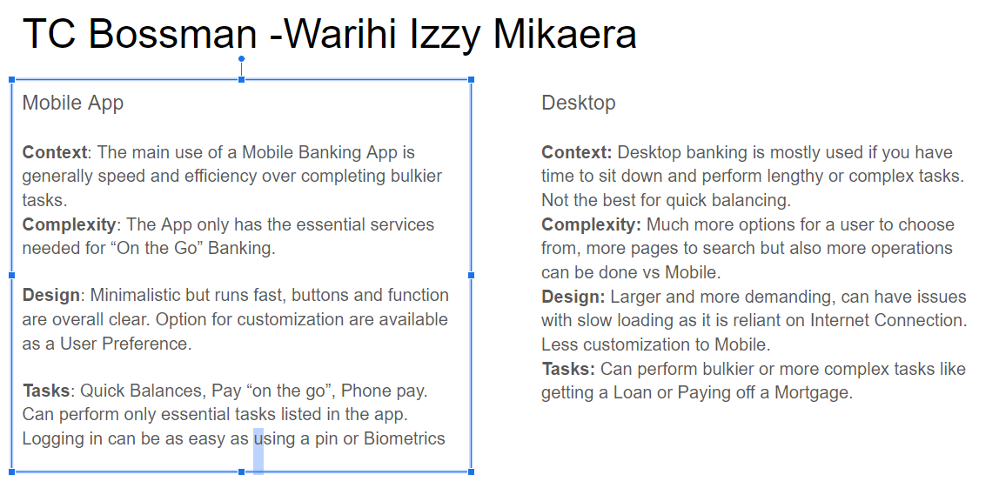
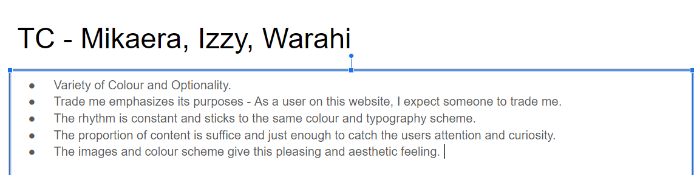
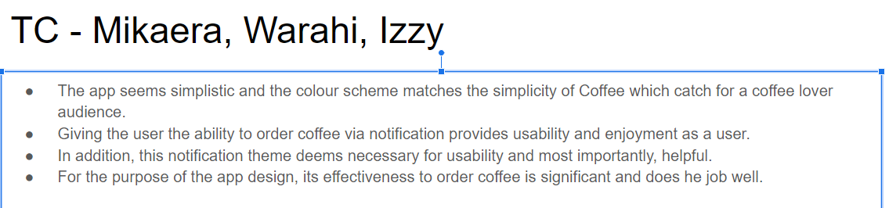
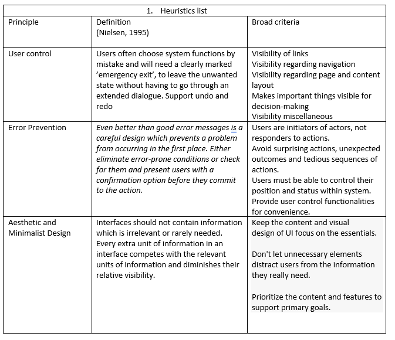
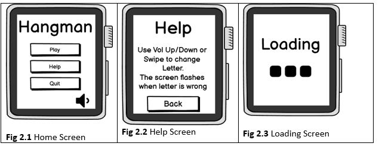
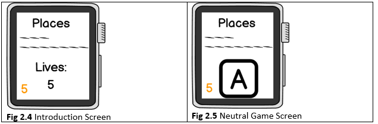
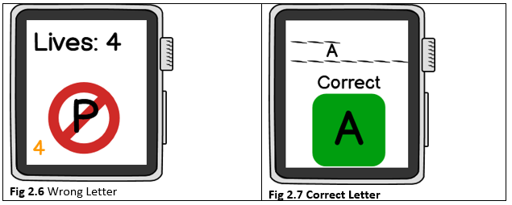
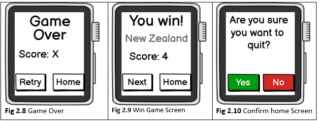

# UX AND UI ACTIVITIES-tc2

## Activity 1: Parkmate Design

## Activity 2: ASB Mobile vs Desktop

## Activity 3: TradeMe

## Activity 4: Usability goals: AirNZ

## Activity 5: Paper Wireframe 

### Functional Requirements (Hangman)

+ Once the game is installed, the App will request permission to edit its own files
+ All buttons within the App will follow to the correct stages (Help button will take you to help page)
+ The Game should be able to generate phrases from within its files

### Paper Wireframe

### Main processes of App

This wireframe design has a total of 8 pages, each with its own unique purpose that makes up the game. 
1.	Main Menu Screen. User can mute sound, play game, get Help on playing the game, or Quit the program. 
2.	Help Page. Explains the rules of the game, has a back button which will bring the user back to Main Menu Page.
3.	Loading Screen. Only pops up when Play is pressed, Game is Reset or moving to next round. 
4.	Info Game Screen. Shows the user the theme of the phrase, the blank letters as well as the amount of lives they have (which is set to 5 after every win/loss).
5.	Neutral Game Screen. Screen which shows the users remaining lives, the aforementioned Theme & Phrase, as well as the letter one can input (can be changed using Vol Up/Down or swiping Up/Down)
6.	Wrong Letter screen. If a letter is wrong, the player loses a life and the letter is placed over a Red NO symbol. Letter is then removed from list of available letters to guess off of.
7.	Correct Letter Screen. Correct letters will be placed in the missing area, square surrounding the letter turns green with the text “Correct” over it. Correct letters are also removed from the list of available letters.
8.	Game Over Screen. When the player runs out of lives, “Game Over” comes up and shows the player score which is based off of their lives carried over from a previous round. The option to return HOME or Retry (not on wireframe) come up on the screen. 
9.	Win Screen. When the correct phrase is guessed then the player wins. Screen shows the Phrase, “You win” in large text as well as Score, Return home or Next round buttons. 

## Activity 6: Heuristic

### Heuristic Evaluation: Hangman Game 

#### Heuristic Principles:

### Evaluation of Hangman Game

#### Main Menu Screens

##### The Home page is pretty straightforward with presenting the options for the user to interact with as seen in figure 2.1. Although the design is rather basic, it suits the capabilities of the device it is running as we did not want to have a program that is very demanding and can cause issues such as delays, freezing or crashing (Minimalist Design).

##### When selecting either option, it changes screens to what the user has selected. The user can see they have selected the Play button as a loading screen comes onto the screen (Error Prevention). On the Help Screen, there is a large BACK button that will bring the user back to the main menu screen to either press Play or Quit the game (Error Prevention) (User Control)

#### Neutral Game Screens

##### The introduction screen shown in fig 2.4 shows the user the theme of the word, the number of words/letters that make up the word and includes the amount of lives the player has (Error Prevention).

##### The neutral game screen in fig 2.5 is the main screen that a user will see when after the introduction, this screen is what the user mostly interacts with the letter where they either swipe or use volume buttons to change the letter as it is explained in the Help Page (User Control / Error Prevention).

##### When doing the design, it seemed better to keep the essential text larger than the rest, as seen where the Theme of the word and the Letter is much larger than other items on the screen (Aesthetic / Error Prevention).

#### Answer Screens

##### When the user guesses the wrong letter as seen in fig 2.6, the screen changes to that letter with a red cross over it with the text “Wrong” (will fix) over said letter (Error Prevention), the screen will automatically switch back to Neutral Game Screen where the orange number will switch to the amount of lives user has left. (Aesthetic)

##### When the user guesses the correct letter as seen in fig 2.7, the box surrounding the letter turns green and the correct letter is filled in a spot. (Error Prevention)

##### For both instances, the guessed letter will not show up anymore when they scroll through the remaining letters, this only changes in a new round or game. (User Control)

#### End Game Screens

